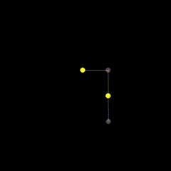
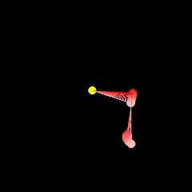
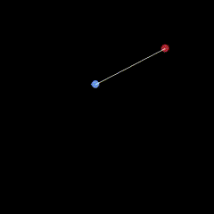

# Physics engine basics in python
(Project is still in work)

This project is a summary of the key concepts I learned in the field of physics engines.
The code for this is done in python, using the [pygame](https://www.pygame.org/news) library for visualization. I use python because the syntax is easy to understand.
I summarised the theory in a series of PDFs, which can be found in the [pdfs](pdfs) folder.

#### Tutorial PDFS:
1. [Intro / Solving ODEs](pdfs/1_intro.pdf)
2. [Constraints](pdfs/2_constraints.pdf)
3. Rigid Bodies

## Examples of the physics engine in action:
All of these examples are interactable. You can click to create temporary springs that drag the particles around.
#### Triple Pendulum:

- Triple pendulum simulation using constraints only
- Link: [pendulums/triple_pendulum.py](pendulums/triple_pendulum.py)

#### Chaotic behaviour of a double pendulum:

- Visualization of how a slight change in initial conditions can lead to a completely different trajectory
in a double pendulum (also using constraints only)
- Link: [pendulums/chaotic_double_pendulum.py](pendulums/chaotic_double_pendulum.py)

#### Particles constrained to functions:

- Particles constrained to "rails" which have the shape of a function
- In this Example f(x) = sin(x) and g(x) = x
- Link: [function_constraints.py](function_constraints.py)
